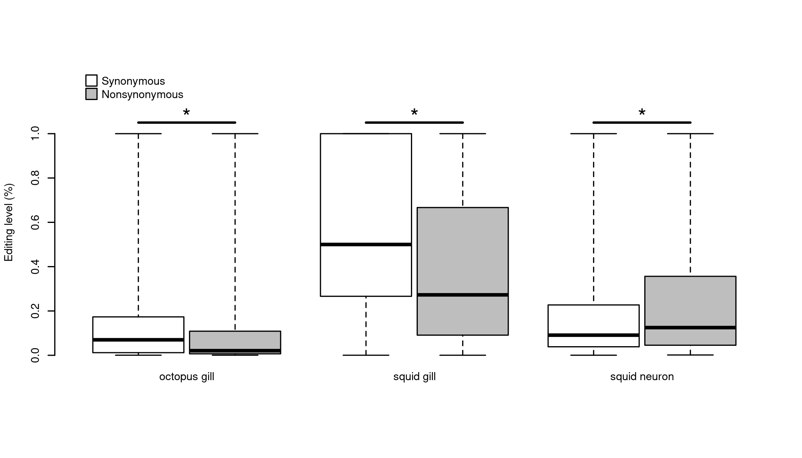
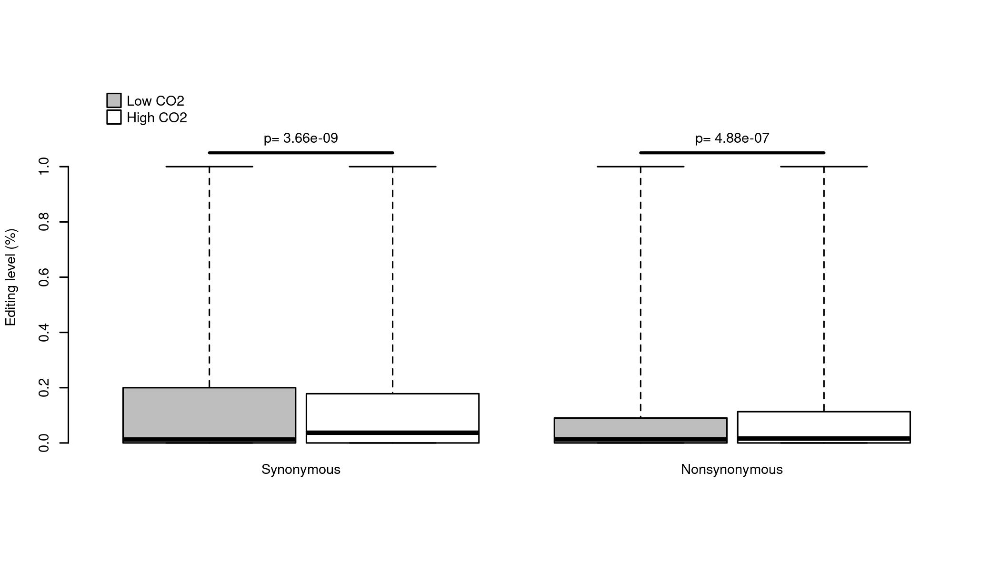

# Loading the data
First I am loading all of the data
```{r}
edits.raw=read.csv("aes_profile.csv") 
```

Then, I am trimming the data to only the sites that have mRNA coverage from all 6 octopuses
```{r}
edits=edits.raw[edits.raw$octo1_tot>0&edits.raw$octo2_tot>0&
                  edits.raw$octo3_tot>0&edits.raw$octo4_tot>0&
                  edits.raw$octo5_tot>0&edits.raw$octo6_tot>0,]
```

# Finding the actual edited base
None of the fields that are currently in the dataset actually give what the base edited to for the weak editing sites.  For the strong edits you can gather this data from the mrna_cons field, but for the weak edits this field will match the gdna_cons field and not represent what the base was changed to.  This bit of code is intended to give what is the most common mRNA base that does not match the gDNA.

```{r}
edits$A=edits$octo1_A+edits$octo2_A+edits$octo3_A+edits$octo4_A+edits$octo5_A+edits$octo6_A
edits$C=edits$octo1_C+edits$octo2_C+edits$octo3_C+edits$octo4_C+edits$octo5_C+edits$octo6_C
edits$G=edits$octo1_G+edits$octo2_G+edits$octo3_G+edits$octo4_G+edits$octo5_G+edits$octo6_G
edits$T=edits$octo1_T+edits$octo2_T+edits$octo3_T+edits$octo4_T+edits$octo5_T+edits$octo6_T

edits$edited=NA

base.edit=apply(edits[edits$gdna_con=="A",44:46],1,FUN="which.max")
base.edit[base.edit==1]="C"
base.edit[base.edit==2]="G"
base.edit[base.edit==3]="T"
edits$edited[edits$gdna_con=="A"]=base.edit


base.edit=apply(edits[edits$gdna_con=="C",c(43,45,46)],1,FUN="which.max")
base.edit[base.edit==1]="A"
base.edit[base.edit==2]="G"
base.edit[base.edit==3]="T"
edits$edited[edits$gdna_con=="C"]=base.edit

base.edit=apply(edits[edits$gdna_con=="G",c(43,44,46)],1,FUN="which.max")
base.edit[base.edit==1]="A"
base.edit[base.edit==2]="C"
base.edit[base.edit==3]="T"
edits$edited[edits$gdna_con=="G"]=base.edit

base.edit=apply(edits[edits$gdna_con=="T",c(43:45)],1,FUN="which.max")
base.edit[base.edit==1]="A"
base.edit[base.edit==2]="C"
base.edit[base.edit==3]="G"
edits$edited[edits$gdna_con=="T"]=base.edit
```

# Editing percentages

I need to calculate editing percentages for each octopus
```{r}

edits$octo1_per=0
edits$octo2_per=0
edits$octo3_per=0
edits$octo4_per=0
edits$octo5_per=0
edits$octo6_per=0

bases=c("A","C","G","T")

start.per.columns=which(colnames(edits)=="octo1_per")
spc=start.per.columns

for (j in 0:5){
  for (i in 0:3){
    per.column=start.per.columns+j
    base.column=(5*j)+6+i
    tot.column=10+5*j
    edits[edits$gdna_con==bases[i+1],start.per.columns+j]=
      1-edits[edits$gdna_con==bases[i+1],((5*j)+6+i)]/
      edits[edits$gdna_con==bases[i+1],10+5*j]
  }
}
```

# Plotting frequency of edit types
Previous work on cephalopod nervous systems has found that A to I edits are by far the most common of the 12 possible edit types (over 80% of all edits many times).  Here I want to look at the editing frequency by editing type

```{r}
ruby.freq=aggregate(edits$pos~edits$edited+edits$gdna_con,FUN="length")
colnames(ruby.freq)=c("edited","gdna","freq")
barplot(ruby.freq$freq,main="Mismatch frequency by mismatch type")
axis(1,at=seq(from=0.7,to=13.9,length.out=12),
     labels=paste(ruby.freq$gdna,ruby.freq$edited,sep=""),
     lwd=0,padj=-1.5)
```

And lets see what percentage of the total edits are A to G mismatches.  This has often been used to infer the level of "noise" in the edit detection process.
```{r}
sum(edits$gdna_con=="A"&edits$edited=="G")/nrow(edits)
```


# Synonymous/Nonsynonymous and editing percentage

First I want to find mean editing percentages for all octopuses, then separately for octopuses kept in high pCO2 treatment and the control pCO2 treatment.
```{r}
edits.mat=edits[,spc:(spc+5)]
edits$per_mean=apply(edits.mat,MARGIN = 1,FUN="mean")
edits$per_hi=apply(edits[,spc:(spc+2)],MARGIN = 1,FUN="mean")
edits$per_lo=apply(edits[,(spc+3):(spc+5)],MARGIN = 1,FUN="mean")
```

Next, I will add a field that marks each edit position as synonymous or nonsynonymous. Synonymous edits will be those in which the amino acid encoded by the genomic DNA matches that encoded by the edited mRNA.
```{r}
edits$syn="nonsynonymous"
edits$syn[edits$genomic_amino==edits$edited_amino]="synonymous"
edits$syn=as.factor(edits$syn)
edits$syn=relevel(edits$syn,"synonymous")
```

A previous paper (Xu and Zhang 2014. Human cody RNA editing is generally nonadaptive) had made the argument that a decreased editing level (proportion of mRNA transcripts bearing the edited G) in nonsynonymous edits compared to synonymous edits showed evidence of selection against nonsynonymous edits.  Here I want to investigate the same thing. I am only going to look at the A to I edits for this an analyses from here on out because those are the majority of real edits in most animals, and in cephalopods.
First, lets look at the normality of the editing levels.
```{r}
ks.test(edits$per_mean[edits$gdna_con=="A"&edits$edited=="G"&edits$syn=="synonymous"],"pnorm")
```
```{r}
ks.test(edits$per_mean[edits$gdna_con=="A"&edits$edited=="G"&edits$syn=="nonsynonymous"],"pnorm")
```

Data is very, very not normal, so I am performing a Mann-Whitney test to compare editing levels between synonymous and nonsynonymous edits
```{r}
wilcox.test(edits$per_mean[edits$gdna_con=="A"&edits$edited=="G"&edits$syn=="synonymous"],
            edits$per_mean[edits$gdna_con=="A"&edits$edited=="G"&edits$syn=="nonsynonymous"],
            alternative = "two.sided")
```

```{r}

boxplot(per_mean~syn,data=edits[edits$gdna_con=="A"&edits$edited=="G",],
        range=0,ylab="Editing level",xlab="")

```


# Looking at nonsynonymous/synonymous ratio as a function of editing level.
Alon et al (2015, The majority of transcripts in the squid nervous system are extensively recoded by A-to-I RNA editing) found an increase in the nonsynonmous/synonymous ratio with increasing editing percentage.  This was used as evidence that editing was generally adaptive in the neural tissue of squid.

First, I am making the bins

```{r}
edits$per_bin=round(edits$per_mean-0.05,1)
edits$bin_hi=round(edits$per_hi-0.05,1)
edits$bin_lo=round(edits$per_lo-0.05,1)
```

Next, calculating the percentage for each bin and plotting. The red horizontal bar is the expected editing level if A to G changes were random (from Alon et al, 2015)
```{r}
nonsyn.prop=function(x){
  mean(x=="nonsynonymous")
}

barplot(aggregate(syn~per_bin,data=edits[edits$gdna_con=="A"&edits$edited=="G",],
        FUN="nonsyn.prop")[,2],col="darkblue",ylab="Fraction of nonsynonymous changes",
        xlab="Editing level [%]",ylim=c(0.4,0.9),xpd = F)
abline(h=0.65,col="red",lwd=4)

axis(1,at=seq(from=0.7,to=11.5,length.out=10),labels=paste(seq(from=0,to=90,by=10),"-",
        seq(from=10,to=100,by=10),sep=""),cex.axis=0.8,padj=-2,lwd=0)
```
Keeping this data store for later figures.
```{r}
ruby.dev=aggregate(syn~per_bin,data=edits[edits$gdna_con=="A"&edits$edited=="G",],FUN="nonsyn.prop")
ruby.lo=aggregate(syn~bin_lo,data=edits[edits$gdna_con=="A"&edits$edited=="G",],FUN="nonsyn.prop")
ruby.hi=aggregate(syn~bin_hi,data=edits[edits$gdna_con=="A"&edits$edited=="G",],FUN="nonsyn.prop")

```

# Replicating this analysis with Squid neuron data from Alon et al 2015 to verify pipeline

```{r}
squid.ner=read.csv("squid_nervous_aes_profile_edit_info.csv")
```

There seems to be some strangeness in this data.  Some of the mRNA consensus bases match neither the gDNA consensus or the "base_edited2" field.  There are about 3k of those, so I am dropping those.  Also, there seems to be a lot of entries for which the "num_tot" is 0.  I am dropping those as well.
```{r}
squid.ner=squid.ner[!(squid.ner$mrna_con!=squid.ner$gdna_con&squid.ner$mrna_con!=squid.ner$base_edited2),]
squid.ner=squid.ner[squid.ner$num_tot!=0,]
```

Finding editing percentages
```{r}
bases=c("A","C","G","T")
squid.ner$per=0
squid.ner$per[squid.ner$gdna_con=="A"]=1-(squid.ner$num_A[squid.ner$gdna_con=="A"]/
                                            squid.ner$num_tot[squid.ner$gdna_con=="A"])
squid.ner$per[squid.ner$gdna_con=="C"]=1-(squid.ner$num_C[squid.ner$gdna_con=="C"]/
                                            squid.ner$num_tot[squid.ner$gdna_con=="C"])
squid.ner$per[squid.ner$gdna_con=="G"]=1-(squid.ner$num_G[squid.ner$gdna_con=="G"]/
                                            squid.ner$num_tot[squid.ner$gdna_con=="G"])
squid.ner$per[squid.ner$gdna_con=="T"]=1-(squid.ner$num_T[squid.ner$gdna_con=="T"]/
                                            squid.ner$num_tot[squid.ner$gdna_con=="T"])
```


Somehow there are some positions with 0 percent editing (558 of them), which shouldn't be possible.  I am removing those.
```{r}
squid.ner=squid.ner[squid.ner$per!=0,]
```

# Plotting mismatch frequency by type
```{r}
squid.ner.freq=aggregate(squid.ner$pos~squid.ner$base_edited2+squid.ner$gdna_con,FUN="length")
colnames(squid.ner.freq)=c("edited","gdna","freq")
barplot(squid.ner.freq$freq,main="Squid neuron mismatch frequency by mismatch type")
axis(1,at=seq(from=0.7,to=13.9,length.out=12),
     labels=paste(squid.ner.freq$gdna,squid.ner.freq$edited,sep=""),
     lwd=0,padj=-1.5)
```

Seeing the percentage of A to I edits
```{r}
sum(squid.ner$gdna_con=="A"&squid.ner$base_edited2=="G")/nrow(squid.ner)
```


# Synonymous vs nonsynonymous edits in squid
Finding the synonymous vs nonsynonymous edits
```{r}
squid.ner$syn="nonsynonymous"
squid.ner$syn[squid.ner$genomic_amino==squid.ner$edited_amino]="synonymous"
squid.ner$syn=as.factor(squid.ner$syn)
squid.ner$syn=relevel(squid.ner$syn,"synonymous")
```

Significant tests to see if there is a significant difference between synonymous and nonsynonymous edits. 
```{r}
wilcox.test(squid.ner$per[squid.ner$syn=="synonymous"&
                            squid.ner$gdna_con=="A"&
                            squid.ner$base_edited2=="G"],
             squid.ner$per[squid.ner$syn=="nonsynonymous"&
                             squid.ner$gdna_con=="A"&
                             squid.ner$base_edited2=="G"])
```

```{r}
boxplot(per~syn,data=squid.ner[squid.ner$gdna_con=="A"&squid.ner$base_edited2=="G",],range=0)
```

There is, but it is in the opposite direction.  There is a significantly higher editing proportion of nonsynonymous edits.


```{r}
squid.ner$per_bin=round(squid.ner$per-0.05,1)

#squidner.dev=aggregate(syn~per_bin,data=squid.ner,FUN="nonsyn.prop")

squidner.dev=aggregate(syn~per_bin,data=squid.ner[squid.ner$gdna_con=="A"&
                                                    squid.ner$base_edited2=="G",],
                       FUN="nonsyn.prop")
```

```{r}
barplot(aggregate(syn~per_bin,
                  data=squid.ner[squid.ner$gdna_con=="A"&
                                   squid.ner$base_edited2=="G",],
                  FUN="nonsyn.prop")[,2],
        col="darkblue",ylab="Fraction of nonsynonymous changes",
        xlab="Editing level [%]",ylim=c(0.4,0.9),xpd = F)
abline(h=0.65,col="red",lwd=4)

axis(1,at=seq(from=0.7,to=11.5,length.out=10),labels=paste(seq(from=0,to=90,by=10),"-",
        seq(from=10,to=100,by=10),sep=""),cex.axis=0.8,padj=-2,lwd=0)
```

# Now for Squid Gill

```{r}
squid.gil=read.csv("squid_gill_aes_profile_edit_info_EDITED.csv")
```

There seems to be some strangeness in this data.  Some of the mRNA consensus bases match neither the gDNA consensus or the "base_edited2" field.  There are about 3k of those, so I am dropping those.  Also, there seems to be a lot of entries for which the "num_tot" is 0.  I am dropping those as well.


```{r}
squid.gil=squid.gil[!(squid.gil$mrna_con!=squid.gil$gdna_con&squid.gil$mrna_con!=squid.gil$base_edited2),]
squid.gil=squid.gil[squid.gil$num_tot!=0,]
```

Finding editing percentages
```{r}
bases=c("A","C","G","T")
squid.gil$per=0
squid.gil$per[squid.gil$gdna_con=="A"]=1-(squid.gil$num_A[squid.gil$gdna_con=="A"]/
                                            squid.gil$num_tot[squid.gil$gdna_con=="A"])
squid.gil$per[squid.gil$gdna_con=="C"]=1-(squid.gil$num_C[squid.gil$gdna_con=="C"]/
                                            squid.gil$num_tot[squid.gil$gdna_con=="C"])
squid.gil$per[squid.gil$gdna_con=="G"]=1-(squid.gil$num_G[squid.gil$gdna_con=="G"]/
                                            squid.gil$num_tot[squid.gil$gdna_con=="G"])
squid.gil$per[squid.gil$gdna_con=="T"]=1-(squid.gil$num_T[squid.gil$gdna_con=="T"]/
                                            squid.gil$num_tot[squid.gil$gdna_con=="T"])
```


Somehow there are some positions with 0 percent editing (558 of them), which shouldn't be possible.  I am removing those.
```{r}
squid.gil=squid.gil[squid.gil$per!=0,]
```


```{r}
squid.gil.freq=aggregate(squid.gil$pos~squid.gil$base_edited2+squid.gil$gdna_con,FUN="length")
colnames(squid.gil.freq)=c("edited","gdna","freq")
barplot(squid.gil.freq$freq,main="Squid gill mismatch frequency by mismatch type")
axis(1,at=seq(from=0.7,to=13.9,length.out=12),
     labels=paste(squid.gil.freq$gdna,squid.gil.freq$edited,sep=""),
     lwd=0,padj=-1.5)
```
What is the proportion of A to G editing in squid gil
```{r}
sum(squid.gil$gdna_con=="A"&squid.gil$base_edited2=="G")/nrow(squid.gil)
```

# Synonymous vs nonsynonymous edits
Finding the synonymous vs nonsynonymous edits

```{r}
squid.gil$syn="nonsynonymous"
squid.gil$syn[squid.gil$genomic_amino==squid.gil$edited_amino]="synonymous"
squid.gil$syn=as.factor(squid.gil$syn)
squid.gil$syn=relevel(squid.gil$syn,"synonymous")
```


```{r}
wilcox.test(squid.gil$per[squid.gil$syn=="synonymous"&
                            squid.gil$gdna_con=="A"&
                            squid.gil$base_edited2=="G"],
                          squid.gil$per[squid.gil$syn=="nonsynonymous"&
                                          squid.gil$gdna_con=="A"&
                                          squid.gil$base_edited2=="G"])

```


```{r}
boxplot(per~syn,data=squid.gil[squid.gil$gdna_con=="A"&squid.gil$base_edited2=="G",],range=0)
```


```{r}
squid.gil$per_bin=round(squid.gil$per-0.05,1)


squidgil.dev=aggregate(syn~per_bin,data=squid.gil[squid.gil$gdna_con=="A"&
                                                    squid.gil$base_edited2=="G",],
                       FUN="nonsyn.prop")
```


```{r}
barplot(aggregate(syn~per_bin,data=squid.gil[squid.gil$gdna_con=="A"&
                                               squid.gil$base_edited2=="G",],
                  FUN="nonsyn.prop")[,2],
        col="darkblue",ylab="Fraction of nonsynonymous changes",
        xlab="Editing level [%]",ylim=c(0.3,0.9),xpd = F)
abline(h=0.65,col="red",lwd=4)

axis(1,at=seq(from=0.7,to=11.5,length.out=10),labels=paste(seq(from=0,to=90,by=10),"-",
        seq(from=10,to=100,by=10),sep=""),cex.axis=0.8,padj=-2,lwd=0)
```


# Comparing all three tissues
## Looking at fraction of nonsynonymous by editing level
```{r}
plot(syn~per_bin,data=squidner.dev,ylim=c(0.30,0.85),
     type="l",col="blue",ylab="Proportion of nonsynonymous edits",
     xlab="Editing level")
points(syn~per_bin,data=squidner.dev,pch=21,bg="blue")
lines(syn~per_bin,data=squidgil.dev,col="green")
points(syn~per_bin,data=squidgil.dev,pch=21,bg="green")
lines(syn~bin_hi,data=ruby.hi,col="red")
points(syn~bin_hi,data=ruby.hi,pch=21,bg="red")
lines(syn~bin_lo,data=ruby.lo,col="purple")
points(syn~bin_lo,data=ruby.lo,pch=21,bg="purple")
abline(h=0.65)
```


## Looking at editing level between synonymous and nonsynonymous
First, I am making the dataset to plot
```{r}
boxy=data.frame(rbind(
  cbind(rep("squid neuron",nrow(squid.ner[squid.ner$gdna_con=="A"&squid.ner$base_edited2=="G",])),
        as.character(squid.ner$syn[squid.ner$gdna_con=="A"&squid.ner$base_edited2=="G"]),
        squid.ner$per[squid.ner$gdna_con=="A"&squid.ner$base_edited2=="G"]),
  cbind(rep("squid gill",nrow(squid.gil[squid.gil$gdna_con=="A"&squid.gil$base_edited2=="G",])),
        as.character(squid.gil$syn[squid.gil$gdna_con=="A"&squid.gil$base_edited2=="G"]),
        squid.gil$per[squid.gil$gdna_con=="A"&squid.gil$base_edited2=="G"]),
  cbind(rep("octopus gill",nrow(edits[edits$gdna_con=="A"&edits$edited=="G",])),
        as.character(edits$syn[edits$gdna_con=="A"&edits$edited=="G"]),
        edits$per_mean[edits$gdna_con=="A"&edits$edited=="G"])
))
colnames(boxy)=c("tissue","type","per")
boxy$per=as.numeric(boxy$per)
boxy$tissue=as.factor(boxy$tissue)
boxy$type=as.factor(boxy$type)
boxy$type=relevel(boxy$type,"synonymous")
```


```{r message=FALSE, warning=FALSE}
png("syn.png",width=7,height=4,units="in",res=300,pointsize=7)
boxplot(per~type+tissue,data=boxy,range=0,at=c(1,1.85,3,3.85,5,5.85),
        ylim=c(-0.1,1.3),axes=F,xlab="",ylab="Mismatch level",
        col=c("white","grey"))
axis(2,at=seq(from=0,to=1,by=0.2))
text(mean(c(1,1.85)),-0.1,"octopus gill")
text(mean(c(3,3.85)),-0.1,"squid gill")
text(mean(c(5,5.85)),-0.1,"squid neuron")
legend(x=0.5,y=1.3,pch=22,pt.cex=2.5,
       legend=c("Synonymous","Nonsynonymous"),
       pt.bg=c("white","grey"),bty="n")
lines(c(1,1.85),c(1.05,1.05),lwd=2)
text(mean(c(1,1.85)),1.1,"*",cex=2)
lines(c(3,3.85),c(1.05,1.05),lwd=2)
text(mean(c(3,3.85)),1.1,"*",cex=2)
lines(c(5,5.85),c(1.05,1.05),lwd=2)
text(mean(c(5,5.85)),1.1,"*",cex=2)
dev.off()
```


# Are there editing level differences between high CO2 and Low CO2?


```{r}
hilo=cbind(stack(edits[edits$gdna_con=="A"&edits$edited=="G",55:56]),
           rep(edits$syn[edits$gdna_con=="A"&edits$edited=="G"],2))
colnames(hilo)=c("per","co2","syn")
hilo$co2=as.factor(hilo$co2)
hilo$syn=as.factor(hilo$syn)
```


```{r, eval=F}
ks.test(hilo$per[hilo$co2=="per_hi"&hilo$syn=="nonsynonymous"],"pnorm")
```

So instead we do a paired Mann-Whitney test on each.

```{r}
nonsyn.wilcox=wilcox.test(edits$per_lo[edits$gdna_con=="A"&
                                         edits$edited=="G"&
                                         edits$syn=="nonsynonymous"],
            edits$per_hi[edits$gdna_con=="A"&
                           edits$edited=="G"&
                           edits$syn=="nonsynonymous"],paired=T)
nonsyn.wilcox
```

```{r}
syn.wilcox=wilcox.test(edits$per_lo[edits$gdna_con=="A"&edits$edited=="G"&edits$syn=="synonymous"],
            edits$per_hi[edits$gdna_con=="A"&edits$edited=="G"&edits$syn=="synonymous"],paired=T)
syn.wilcox
```

```{r}
png("high-low.png",width=7,height=4,units="in",res=300,pointsize=7)
#svg("high-low.svg")
boxplot(per~co2+syn,data=hilo,range=0,at=c(1.85,1,3.85,3),ylim=c(-0.1,1.3),
        axes=F,xlab="",ylab="Mismatch level",col=c("white","grey"))
axis(2,at=seq(from=0,to=1,by=0.2))
text(mean(c(1,1.85)),-0.1,"Synonymous")
text(mean(c(3,3.85)),-0.1,"Nonsynonymous")
legend(x=0.5,y=1.3,pch=22,pt.cex=2.5,
       legend=c("Low CO2","High CO2"),
       pt.bg=c("grey","white"),bty="n")
lines(c(1,1.85),c(1.05,1.05),lwd=2)
text(mean(c(1,1.85)),1.1,paste("p=",round(syn.wilcox$p.value,11)),cex=1)
lines(c(3,3.85),c(1.05,1.05),lwd=2)
text(mean(c(3,3.85)),1.1,paste("p=",round(nonsyn.wilcox$p.value,9)),cex=1)
dev.off()
```


